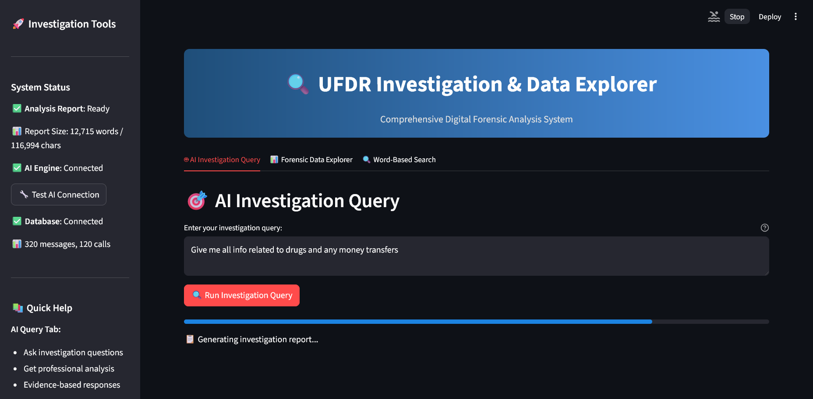
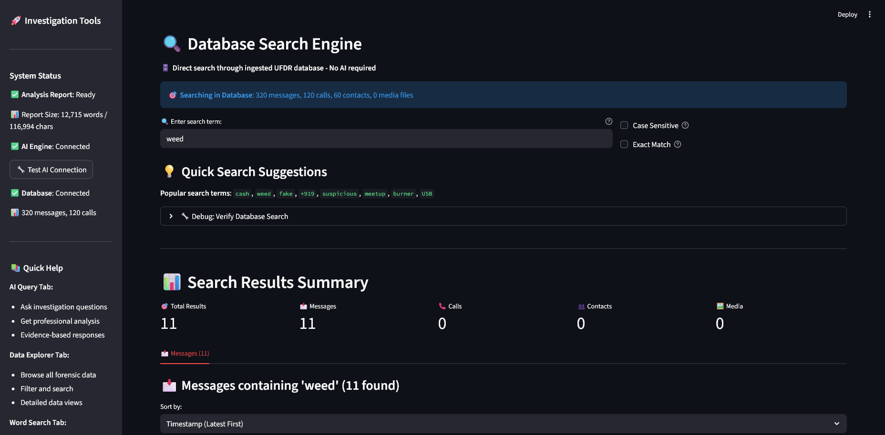
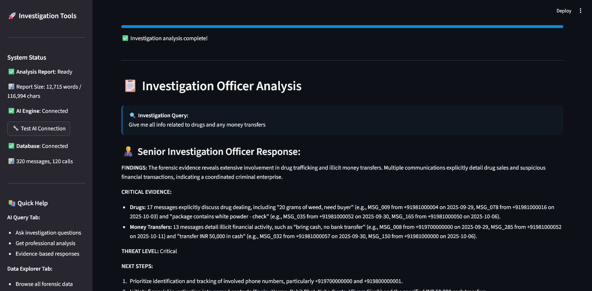
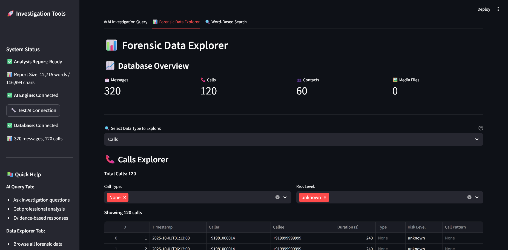

# Smart India Hackathon 2025 | UFDR AI Analyzer

> ## ⚠️ Archived Project
> This was a submission for Smart India Hackathon 2025. While not selected, the tool is functional with sample forensic data included. Development has stopped.

### **🏢 Ministry of Home Affairs (MHA) | Problem Statement `SIH25198`**

**🔍 AI-based UFDR (Universal Forensic Extraction Device Report) Analysis Tool**

Advanced AI-powered forensic investigation toolkit for law enforcement agencies, providing intelligent analysis of digital evidence from mobile devices and computers.

<br clear="left"/>

<div align="center">

[](https://sih.gov.in/)
[]()
[]()

[](https://opensource.org/licenses/MIT)
[](https://www.python.org/downloads/)
[](https://streamlit.io/)
[](https://ai.google.dev/)

</div>

UFDR AI Analyzer is an intelligent forensic investigation toolkit that processes Universal Forensic Data Reports (UFDR) and provides AI-powered analysis for digital evidence examination. Built for law enforcement agencies, cybersecurity professionals, and digital forensics investigators.

##  Application Screenshots

<div align="center">

| Main Dashboard | Database Search |
|:-:|:-:|
|  |  |
| *Interactive dashboard with forensic data statistics and overview* | *Advanced keyword search across all evidence types* |

| AI Query Interface | File Explorer |
|:-:|:-:|
|  |  |
| *AI-powered investigation queries with intelligent responses* | *Comprehensive evidence file browser and analysis tools* |

</div>

The application provides a modern web interface for forensic data analysis with real-time AI-powered insights and comprehensive evidence exploration capabilities.

## 🎯 Key Features

### 🤖 AI-Powered Investigation Assistant
- **Natural Language Queries**: Ask complex questions about evidence in plain English
- **Concise Professional Reports**: Focused responses under 200 words with actionable intelligence
- **Evidence Cross-Referencing**: Automatic linking of related messages, calls, and contacts
- **Risk Assessment**: AI-driven threat classification (Critical/High/Medium/Low)
- **Pattern Recognition**: Identifies suspicious communication patterns and criminal networks

### 📊 Advanced Data Processing Engine
- **Multi-Format Ingestion**: Supports messages, call logs, contacts, and multimedia evidence
- **Bulk Analysis Optimization**: Processes entire datasets for comprehensive context understanding
- **Real-Time Search**: Lightning-fast keyword and content searches across all evidence
- **Smart Filtering**: AI-assisted filtering by risk level, content type, and relevance

### 🔍 Professional Investigation Dashboard
- **Evidence Timeline**: Chronological visualization of all forensic evidence
- **Network Mapping**: Visual representation of communication networks and relationships
- **Suspicious Activity Detection**: Automated flagging of high-risk communications
- **Export & Reporting**: Generate professional investigation reports for court proceedings
- **Multi-User Support**: Secure access controls for investigation teams

## 🚀 Complete Setup Guide

### 📋 Prerequisites

Before you begin, ensure you have:
- **Python 3.10 or higher** ([Download here](https://www.python.org/downloads/))
- **Git** installed ([Download here](https://git-scm.com/downloads))
- **Google Gemini API key** ([Get free key here](https://aistudio.google.com/app/apikey))
- **4GB+ RAM** recommended for smooth operation
- **Internet connection** for AI features

### 🛠️ Step-by-Step Installation

#### Step 1: Clone the Repository
```bash
git clone https://github.com/LORDv1shnu/ufdr-analyzer-sih25.git
cd ufdr-analyzer-sih25
```

#### Step 2: Create Virtual Environment
```bash
# Create virtual environment
python -m venv .venv

# Activate virtual environment
# Windows (PowerShell)
.\.venv\Scripts\Activate.ps1

# Windows (Command Prompt)
.venv\Scripts\activate.bat

# Linux/Mac
source .venv/bin/activate
```

#### Step 3: Install Dependencies
```bash
# Upgrade pip first
python -m pip install --upgrade pip

# Install all required packages
pip install -r requirements.txt
```

#### Step 4: Configure Google Gemini API Key

**Option A: Using apikey.txt file (Recommended)**
```bash
# Create the API key file
# Windows
echo your_actual_gemini_api_key_here > apikey.txt

# Linux/Mac
echo "your_actual_gemini_api_key_here" > apikey.txt
```

**Option B: Using config.py file**
```bash
# Copy template and edit
cp config.template.py config.py
# Then edit config.py and replace "your_actual_api_key_here" with your key
```

**Option C: Using environment variable**
```bash
# Windows (PowerShell)
$env:GEMINI_API_KEY="your_actual_gemini_api_key_here"

# Linux/Mac
export GEMINI_API_KEY="your_actual_gemini_api_key_here"
```

#### Step 5: Import Sample Forensic Data
```bash
# This will create the database and import all sample evidence
python ingest_ufdr.py fake_ufdr
```

**Expected Output:**
```
Imported 60 contacts
Imported 320 messages
Imported 120 calls
Import completed!
```

#### Step 6: Generate AI Analysis (Optional but Recommended)
```bash
# Full analysis including images (takes 2-3 minutes)
python preanalyzer.py

# Or skip images for faster processing (30 seconds)
python preanalyzer.py --skip-images
```

**Expected Output:**
```
🚀 UFDR PRE-ANALYZER - Starting Complete Analysis
📊 Step 1: Analyzing ALL text data with AI...
   ✅ AI analysis complete!
📄 Report size: 120,000+ characters
🎉 PRE-ANALYSIS COMPLETE!
```

#### Step 7: Launch the Application
```bash
# Start the web interface
streamlit run streamlit_app.py

# Or specify a custom port
streamlit run streamlit_app.py --server.port 8501
```

**Expected Output:**
```
  You can now view your Streamlit app in your browser.
  Local URL: http://localhost:8501
  Network URL: http://192.168.1.x:8501
```

#### Step 8: Access the Application
1. Open your web browser
2. Navigate to `http://localhost:8501`
3. You should see the UFDR AI Analyzer dashboard

### 🔧 Troubleshooting Common Issues

#### API Key Issues
```bash
# Check if API key is loaded
python -c "from ai_analyzer import AIAnalyzer; ai = AIAnalyzer(); print('AI Available:', ai.is_available())"
```

#### Database Issues
```bash
# If database issues occur, reset and re-import
rm ufdr.db
python ingest_ufdr.py fake_ufdr
```

#### Port Issues
```bash
# If port 8501 is busy, use a different port
streamlit run streamlit_app.py --server.port 8502
```

#### Module Import Issues
```bash
# Make sure virtual environment is activated
# Windows
.\.venv\Scripts\Activate.ps1

# Then reinstall dependencies
pip install -r requirements.txt
```

### ✅ Verification Steps

After setup, verify everything works:

1. **Check Database**: Navigate to "Data Explorer" tab - should show 320 messages, 120 calls, 60 contacts
2. **Test Search**: Use "Database Search" tab - search for "phone" should return results
3. **Test AI**: Use "AI Investigation" tab - ask "What suspicious activities are present?"
4. **Check Analysis**: If you ran preanalyzer, check that `analysis.txt` exists and is ~120KB

### � Quick Command Reference

```bash
# Basic workflow
git clone https://github.com/LORDv1shnu/ufdr-analyzer-sih25.git
cd ufdr-analyzer-sih25
python -m venv .venv
.\.venv\Scripts\Activate.ps1  # Windows
pip install -r requirements.txt
echo "your_api_key_here" > apikey.txt
python ingest_ufdr.py fake_ufdr
python preanalyzer.py
streamlit run streamlit_app.py
```

### �🚀 You're Ready!

Your UFDR AI Analyzer is now fully set up and ready for forensic investigation work!

**Screenshots Added:**
- ✅ `dashboard.png` - Main dashboard with forensic data statistics (210KB)
- ✅ `database_search.png` - Database search functionality (153KB)  
- ✅ `query_result.png` - AI investigation query responses (176KB)
- ✅ `file_explorer.png` - Evidence file browser and analysis (176KB)

##  Usage Examples

### 🔍 Database Search
```
• "drugs" → Drug-related communications
• "cash transfer" → Financial transactions  
• "phone" → Contact tracking
```

### 🤖 AI Investigation
```
• "What suspicious activities are present?"
• "Who are the main suspects?"
• "What evidence needs immediate attention?"
```

## � Security Features

- **API keys protected** by .gitignore
- **Local processing** - data stays on your machine
- **Offline capable** - works without AI features

## 🎓 Official Smart India Hackathon 2025 Project

<div align="center">

### 🏛️ **Ministry of Home Affairs (MHA)**
**Problem Statement ID:** `SIH25198`  
**Category:** Software Development | **Theme:** Smart Automation

---

**🎯 Mission:** Develop AI-based UFDR Analysis Tool for enhanced digital forensic capabilities  
**🎖️ Status:** Selected among 51 ideas out of 500 submissions  
**📅 Deadline:** 15 October 2025  

**💻 Tech Stack:** Python • Streamlit • Google Gemini AI • SQLModel

</div>

## 📄 License

MIT License - see [LICENSE](LICENSE) file for details.

## 🤝 Support

- Issues: [GitHub Issues](https://github.com/LORDv1shnu/ufdr-analyzer-sih25/issues)
- For bugs and feature requests

---

<div align="center">

**🇮🇳 Made with ❤️ for Smart India Hackathon 2025**  
**Empowering Digital Justice | Ministry of Home Affairs**

</div>